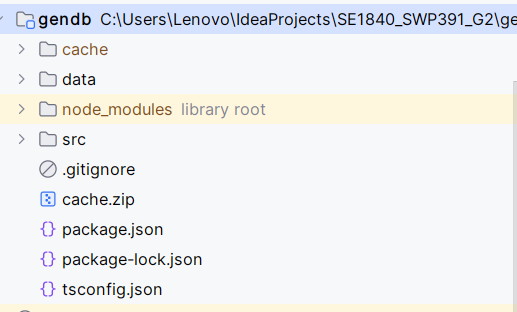
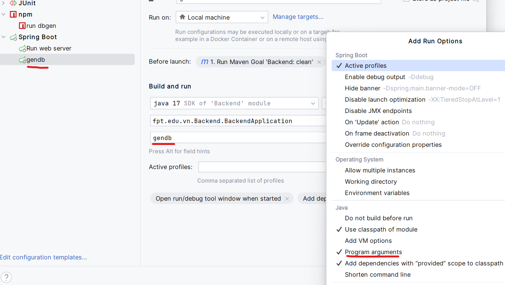

# Tool tạo database

## Chuẩn bị dữ liệu cào
- Giải nén cache.zip
- `cache`: chứa dữ liệu đã cào

## Tạo data
- Cấu hình: `src/config.ts`
- Chạy lệnh `npm run gen`

## Tạo database
- Drop database trước khi chạy

- Chỉnh `DbGenService` nếu bị lỗi đường dẫn